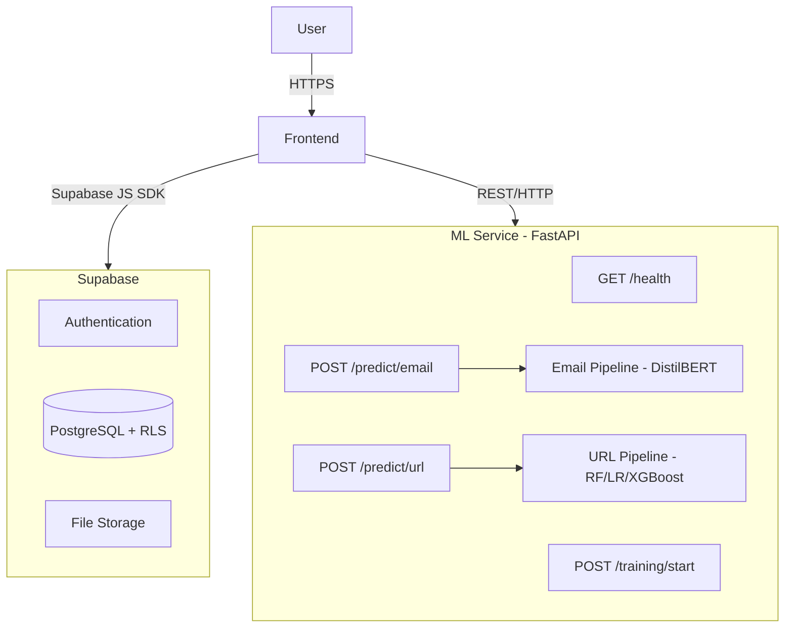

# ShieldMail — Architecture

## Overview

## Component Responsibilities

### Frontend (React + TypeScript)
- Authentication UI (Supabase Auth)
- Scanner forms (email + URL)
- Research dashboard
- Dataset upload
- Training monitoring
- Model registry + comparison
- Admin panel

### Supabase
- User authentication (JWT)
- PostgreSQL database with Row Level Security
- File storage for datasets and model artifacts
- Edge functions (optional)

### ML Service (FastAPI + Python)
- Email phishing classification
- URL phishing classification
- Model loading and caching
- Training job execution
- Evaluation and metrics

## Security Model

- All database access controlled by RLS policies
- Frontend uses anon key only
- Service role key never exposed to frontend
- JWT claims used for role-based access
- Input validation at every layer
