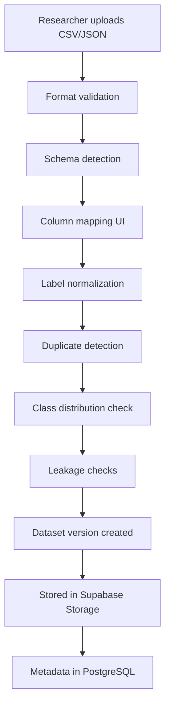

# Dataset Workflow

## Upload Flow

## Column Mapping

Email datasets: `text`, `email`, `body`, `message`, `subject`, `sender`, `label`
URL datasets: `url`, `link`, `website`, `address`, `label`

## Label Normalization

| Input | Normalized |
|-------|-----------|
| `0`, `legitimate`, `benign`, `safe` | `0` (legitimate) |
| `1`, `phishing`, `malicious` | `1` (phishing) |
| Anything else | **Rejected** |

## Versioning

Each upload creates an immutable version:
- `phishing-email-v1`, `phishing-email-v2`, ...
- Never overwrites previous versions
- Stores: file hash, row count, label counts, validation result
