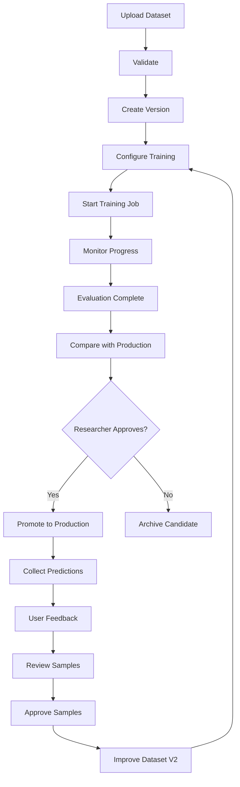

# Research Workflow

## Continuous Improvement Loop

## Model Lifecycle

`experimental` → `validated` → `production` → `archived`

A model can only be promoted to production by a Researcher or Admin with explicit confirmation after reviewing evaluation metrics.
